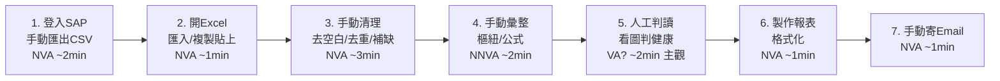
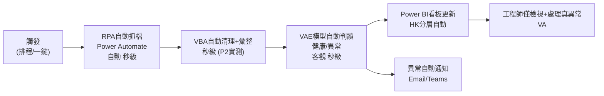

# 價值流圖（Value Stream Map）：設備健康資料處理流程

> Current State（手動）vs Future State（自動化）
> 🟢 實測　🟡 假設　`(P2實測)` 待 P2 回填
> **加值(VA)** = 客戶願意付費的步驟；**非加值(NVA)** = 浪費，應消除；**必要非加值(NNVA)** = 暫時必要

---

## Current State — 手動流程（改善前）

### 步驟盤點
| # | 步驟 | 類型 | 處理時間 | 等待/浪費 | 對應浪費 |
|---|------|------|---------|-----------|---------|
| 1 | 登入 SAP 手動匯出 | NVA | ~2 min 🟡 | 等匯出 | Motion, Waiting |
| 2 | Excel 匯入/貼上 | NVA | ~1 min 🟡 | — | Motion |
| 3 | 手動清理髒資料 | NVA | ~3 min 🟡 | 反覆修 | Overprocessing, Defects |
| 4 | 手動彙整 | NNVA | ~2 min 🟡 | — | Overprocessing |
| 5 | 人工判讀健康 | VA(主觀) | ~2 min 🟡 | 易漏判 | Defects |
| 6 | 製作/格式化報表 | NVA | ~1 min 🟡 | — | Overprocessing |
| 7 | 手動寄 Email | NVA | ~1 min 🟡 | — | Motion |
| — | **合計** | — | **~12 min** 🟡→`(P2實測)` | — | — |

**VA 比率（改善前）：** 僅步驟 5 勉強算加值（且主觀），約 2/12 ≈ **17%**，其餘 83% 為浪費。

---

## Future State — 自動化流程（改善後）

### 步驟盤點
| 步驟 | 類型 | 處理時間 | 消除的原浪費 | 工具 |
|------|------|---------|-------------|------|
| 觸發 | NNVA | 秒級 | — | 排程/按鈕 |
| RPA 自動抓檔 | 自動 | 秒級 🟢 | 步驟1,2 Motion/Waiting | Power Automate (P3) |
| VBA 自動清理彙整 | 自動 | `(P2實測)` 🟢 | 步驟3,4,6 Overprocessing | VBA (P2) |
| VAE 自動判讀 | 自動 | 秒級 🟢 | 步驟5 主觀 Defects | VAE (01-core) |
| 看板更新 + 異常通知 | 自動 | 秒級 | 步驟7 Motion | Power BI+Automate (P5) |
| 工程師檢視真異常 | **VA** | 依需求 | — | 人 |

**人力介入：** 從「7 步全人工」→「僅檢視例外」。工程師時間釋放到真正的分析與改善（消除 Underutilized talent）。

---

## 改善前後對比（摘要）

| 指標 | 改善前 | 改善後 | 來源 |
|------|--------|--------|------|
| 人工步驟數 | 7 | ~1（僅檢視例外） | 🟢 可數 |
| 單次人工耗時 | ~12 min | 趨近 0 | 🟡→P2/P6 實測 |
| 判讀方式 | 主觀人工 | VAE 客觀模型 | 🟢 |
| 監控 | 無/被動 | HK 分層看板即時 | P5 |
| VA 比率 | ~17% | 大幅提升 | — |

> 量化的省時與 ROI 於 [roi-validation.xlsx](roi-validation.xlsx)（P6）以實測綠/假設黃透明計算。
